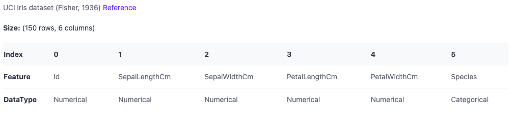

# Load your dataset

To get started on your visualisations, you should first see the `Datasets` tab on [visprex.com](https://visprex.com/#datasets). For demonstration purposes, you can also choose from publicly available example datasets.

## Data format
Visprex currently only supports CSV files. Your CSV file should be delimited by commas, and the end of each row should be followed by a new line.

First line of the file should have a header which indicates the names of columns (your features).

## Data types
Your CSV file will be automatically parsed as one of two data types.

- `Numerical`:  integers and floats (e.g `100`, `3.14`)
- `Categorical`: string values (e.g `"male"`, `"autumn"`)

Once your data is loaded, this information is shown in the botton part of the `Datasets` tab, where each column is assigned an index in order of appearance in the first line of your CSV file along with their inferred data type.

## Load your CSV file
Click on `Click to load your CSV file` and select your CSV file from your local machine.

### Data size
Once your dataset is successfully loaded, it will show `Size:` field which indicates how many rows and columns your CSV file has

### Reference
If you use an example dataset shown below the data loader, you can see the reference with a link to the description of the original data.

### Data schema
Each column will be assigned an index in order of appearance in the first line of your CSV file.
`Feature` is the name of the column and `DataType` is the inferred data type for the corresponding column.
For the `iris.csv` example dataset. The dataset metadata is shown as follows.

