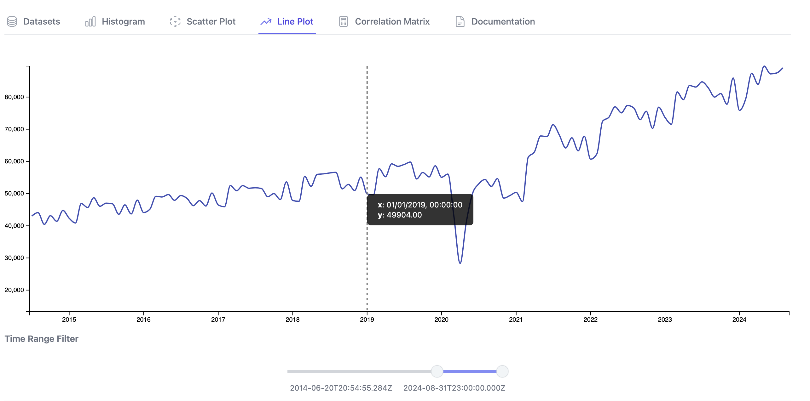

# Identify trends and seasonality over time

**Time Series** data consist of data points indexed by a `DateTime` feature, which can be visualised with a **Line Plot**.

## Setting up your time series data

Once you load your dataset with at least one feature of `DateTime` type, you can visualise `Numerical` values on the **Line Plot** tab.

If you're using an example dataset, click on `restaurant-sales.csv` from the `Datasets` tab, which shows the aggregated monthly retail sales amount in the U.S. from restaurants and similar establishments, in USD millions.

By default, only features of `DateTime` type are displayed as options for the X-Axis, and `Numerical` features on the Y-Axis.

## Zooming into specific time windows

The `Time Range Filter` feature allows you to specify the window of time to display the line plot for by sliding the circles.

Note that the start and end DateTime are displayed in the [ISO 8601](https://en.wikipedia.org/wiki/ISO_8601) format.

## Trends and Seasonality
Time series data can be decomposed into multiple components.

- A **trend** is an overall pattern in a given period of time
- **Seasonality** refers to cyclic behaviours which happen at regular intervals

In the case of this restaurant sales data, for example, one can see

- **Uptrend**: More people are spending more dollars over time
- **Monthly seasonality**: Spending increases during warmer times of the year, such as spring and summer months, and during holiday seasons.

From this line plot, you can also observe anomaly in the beginning of 2020, marked by a sudden decrease in overall spending at restaurants as COVID-19 hit the world.

