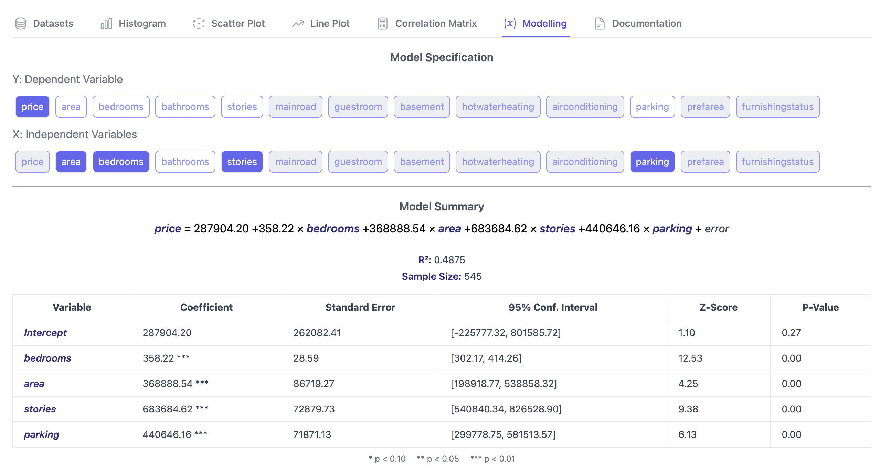

# Quantify your intuition with linear regression

**Linear Regression** helps you model the linear relationship between a variable of your interest (dependent variable) and a set of explanatory variables (independent variables) that describe the variance in the dependent variable.

### Ordinary Least Squares
When you [load your dataset](../datasets/index.md), the `Data Schema` section describes the data types of your variables as well as the shape of the dataset with the number of rows and columns.

For our modelling purposes, we can consider the number of rows as the number of observations $n$ and the number of columns as the number of variables to choose from for your independent and dependent variables.

A dependent variable can be described as a vector $y$ and

$$
y_{i} = \beta_{0} + \beta_{1} x_{i1} + \beta_{2} x_{i2} + \cdots + \beta_{p} x_{ip} + \varepsilon_{i}
$$

where $\beta_{0}$ is the intercept and $\beta_{i}$ is the coefficient for the $i$-th feature, with some error term $\varepsilon$.

### Modelling

> Example: If you wanted to estimate the effect of the number of bedrooms and the area on housing prices, you could set `area` and `bedrooms` as the independent variables and `price` as the dependent variable from the `housing.csv` example dataset. Refer to the [scatterplot](../scatterplot/index.md) section on visualising such linear relationships.

**Model Specification**

- **Y: Dependent Variable**: Choose the variable you want to predict. Only numerical variables are available for selection.
- **X: Independent Variables**: Select one or more numerical variables that explain the variance in the dependent variable.

**Model Summary**

Once the model is fit, the Model Summary section displays your linear regression equation including the intercept term $\beta_0$. Key terms here include:

- \( R^2 \) (Coefficient of determination): Measures the proportion of variance in the dependent variable explained by the independent variables. The higher this value is, the more explanatory power this model has.
- P-values: Indicates statistical significance of each variable. Significance at the 0.01 level is denoted by `***`, 0.05 by `**` and 0.10 by `*`.