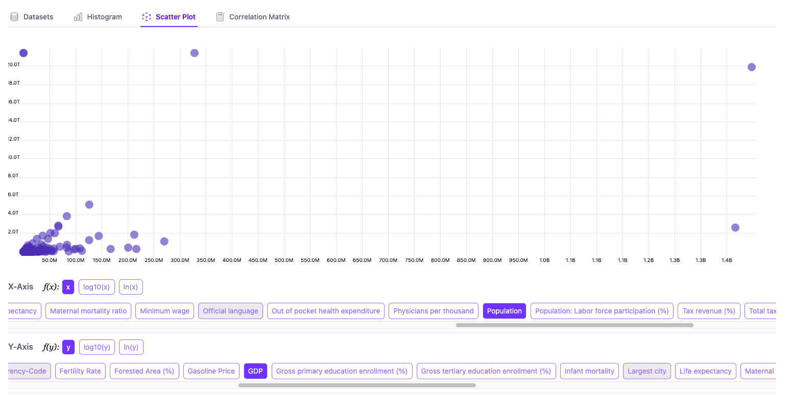
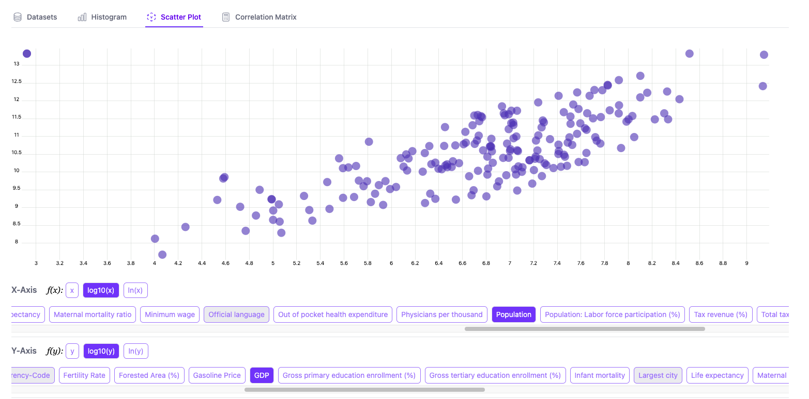
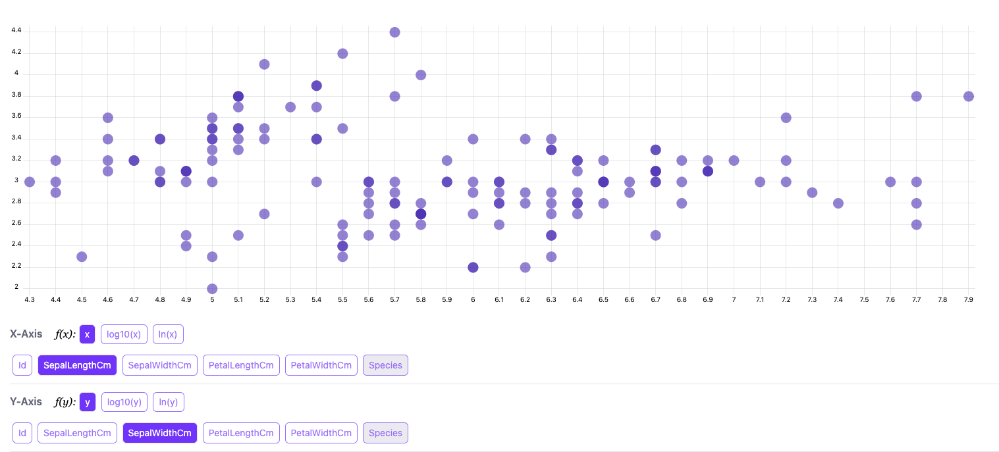

# Visualise linear relationships

**Scatterplot** is an effective tool for visualising the relationship between two variables. 

### Selecting features
It is common to plot the dependent variable (the variable you want to model) on the Y-axis and the independent variables (the variables that you want to study the effects of) on the X-axis.

Note that only `Numerical` features can be selected in scatter plots, and for each `Numerical` feature, we also have feature transformations explained in the [Feature Tranformation](../histogram/index.md#feature-transformation) section in the previous tutorial.

You can also hover over individual data point to see the actual feature values.

## Visualising linear relationships
Using the `world-dataset-2023.csv` from example datasets, let us visualise how fertility rate (X-axis) is related to life expectancy at birth (Y-axis).

One can easily infer that there is a linear trend with a downward slope, meaning that the higher the fertility rate (more children are born), the lower the life expectancy. This is an example of clear linear trends between two variables.

## Visualising log-linear relationships
Let us now try to visualise the relationship between population on X-axis and GDP on Y-axis with the same `world-dataset-2023.csv` dataset.

Since those two variables are heavily skewed to the right, meaning that some countries have very high values, the it is not trvial to draw a straight line between those dots.

However, once you apply log transformations, a much cleaner linear relationship appears between these two variables. This is a good example of log-linear relationship, where the log of dependent variable is partially explained by the log of an independent variable.

## Filters

Filters provide a way to slice your dataset from different angles, using both categorial and numerical features.
There are 3 fields to specify for adding a filter

- **Feature**: which feature to filter on
- **Operator**: which operator to filter with
    - for `Categorical` features, equality (`=`) and inequality (`!=`) are supported
    - for `Numerical` features, less than (`<`), less than or equal to (`<=`), greater than (`>`), greater than or equal to (`>=`) are also supported
- **Value**: value to compare against

Click on the plus icon to add the filter, which shows up directly below.

### Controlling for other variables
While scatter plots give you a good sense of how two variables are distributed, it only provides a simplified picture of the overall distribution as it disreagrds the variance in other features and hence their explanatory power for the dependent variable.

You can use the filters functionality to set a filtering condition to be applied for _all the data points_, which means that only the data points that satisfy those conditions will show up in the scatter plot.

After applying for the filter for `Species = "iris-setosa"`, one can see a linear trend within the species which was not obvious when all the data points were included.

### Visualising a subsection of your dataset

In other cases, filters could be a useful tool if you would like to focus on a specific subgroup of your dataset.

For example, using the `nba-2023-24.csv` dataset, one can plot the relationship between the NBA players' minutes played (`MP`) and the field goal made (`FG`), specifically for those who played for New York Knicks (`NYK`) as follows.

